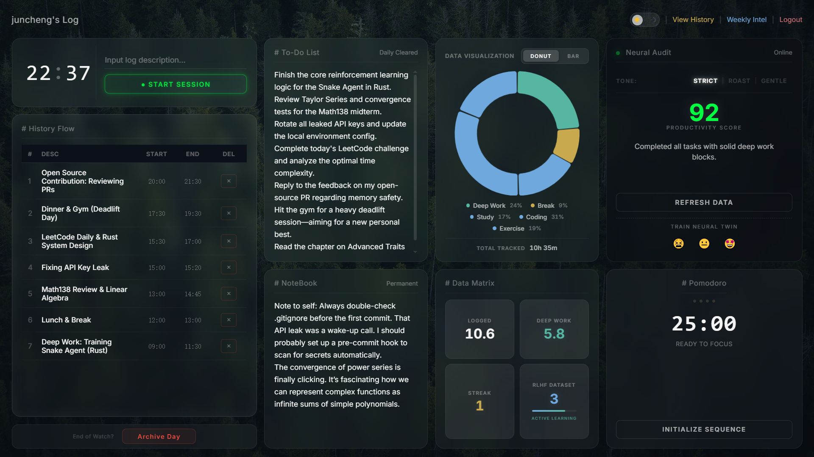
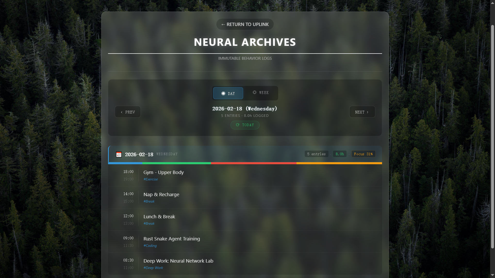
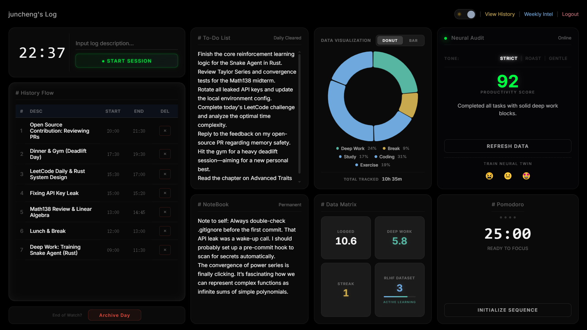
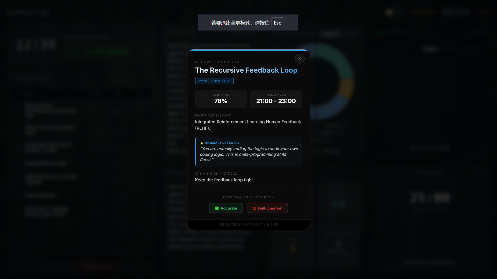

# Onyx | AI-Powered Productivity & Analytics Platform

[](https://onyx.j494zhu.com/login?next=%2F)
[]()
[]()

**[🔴 Live Demo: onyx.j494zhu.com](https://onyx.j494zhu.com/login?next=%2F)** Onyx is a full-stack, AI-augmented analytics and time-management platform. Evolving beyond static productivity tools, Onyx integrates a proprietary **Human-in-the-Loop (HITL)** machine learning pipeline to continuously align its generative AI suggestions with user-specific workflows and preferences.


*(Onyx Dashboard in Light Mode: Subpixel-perfect glassmorphism and real-time telemetry)*

## ✨ Core Features & System Modules

Onyx is engineered as a unified workspace, seamlessly blending manual telemetry with automated AI insights.

### ⏱️ Session Telemetry & Automated Archival
* **History Flow Engine:** Users input active tasks to track session duration. The system dynamically logs these entries into the database via async requests.
* **Smart Archival Pipeline:** Users can manually trigger `Archive Day` to close out their workflow. To prevent data leakage across days, a scheduled background job automatically archives unclosed sessions at **6:00 AM daily**.


*(Comprehensive History Flow and Session Tracking)*

### 📊 Real-Time Analytics & Data Matrix
* **Dynamic Visualization:** Integrated `Chart.js` to render stateful Donut and Bar charts that auto-update the moment a new session is logged, categorizing time spent (e.g., Deep Work, Study, Coding).
* **Quantified Self Matrix:** A dedicated telemetry dashboard tracking critical metrics: Total Logged Hours, Deep Work ratio, Login Streaks, and the growing **RLHF Dataset Confidence Score** representing the AI's training progress.

### 📝 Persistent Task & Focus Management
* **To-Do & Permanent Notebook:** A daily-cleared task list coupled with a persistent notebook for fleeting thoughts, system designs, and long-term knowledge retention.
* **Pomodoro Sequence:** A built-in focus protocol optimized for 25-minute deep work sessions and 3-minute recovery blocks.

---

## 🏗️ Architecture & Deployment

### Scalable Backend
* **Production Deployment:** Hosted on a **DigitalOcean Droplet** and served via **Gunicorn** for robust, multi-threaded request handling.
* **Relational Mapping:** Utilizes `SQLAlchemy` for complex relational queries, secure user authentication (Login/Register), and persistent history tracking.

### Immersive Frontend
* **Dynamic Theme Engine:** Integrated a seamless Light/Dark mode toggle accessible from the top navigation bar, adapting the UI instantly to user environmental preferences.
* **Subpixel-Perfect Glassmorphism:** Engineered a robust, modern UI featuring a frosted glass aesthetic. Successfully debugged and resolved complex subpixel rounding errors across different display scaling environments.


*(Onyx Dashboard dynamically rendered in Dark Mode)*

---

## 🤖 Adaptive AI: Human-in-the-Loop Feedback System

Traditional productivity tools give static, one-size-fits-all advice. Onyx **learns from you**.

Every interaction with the **Daily Neural Audit** and the **Weekly Intel** feeds into a **closed-loop feedback pipeline** that continuously adapts the AI's behavior using Active Learning principles.


*(Weekly Intel Report with integrated RLHF Feedback Module)*

### Context-Aware Analytics (with RLHF)
* **Tri-Modal AI Feedback:** Users can select the AI's persona tone (`Strict`, `Roast`, or `Gentle`). The engine cross-references the user's daily `To-Do List` against their actual `History Flow` and `Deep Work` metrics to generate a customized Productivity Score (0-100) and actionable advice.
* **Macro-Analysis (Weekly Intel):** Synthesizes 7-day telemetry data into comprehensive weekly reviews, identifying long-term bottlenecks and productivity trends.
* **Train Neural Twin (Feedback Loop):** Users rate both the Daily Audit and Weekly Intel using a simplified emoji scale (😖, 😐, 🤩). This feedback increments the RLHF dataset, actively shaping future prompt generation.

### Architecture Flow

```text
┌─────────────┐     ┌──────────────┐     ┌──────────────────┐
│  User Logs  │────▶│ Neural Audit │────▶│  AI Suggestion   │
│  & Context  │     │ /Weekly Intel│     │  + Analysis      │
└─────────────┘     └──────────────┘     └───────┬──────────┘
                                                 │
                                                 ▼
                                         ┌──────────────────┐
                                         │  Human Feedback  │
                                         │  😖 / 😐 / 🤩    │
                                         └───────┬──────────┘
                                                 │
                          ┌──────────────────────┘
                          ▼
                ┌──────────────────┐     ┌──────────────────┐
                │ Feedback Storage │────▶│ Prompt Strategy  │
                │ (Preference DB)  │     │ Optimization     │
                └──────────────────┘     └───────┬──────────┘
                                                 │
                                                 ▼
                                         ┌──────────────────┐
                                         │ Improved Audit   │
                                         │ (Next Session)   │◄─── Loop
                                         └──────────────────┘
```

### ✅ Online Preference Alignment

The system acts on feedback dynamically. Before each Neural Audit or Weekly Intel generation:

1. Recent feedback history is retrieved via `SQLAlchemy`.
2. High-rated and low-rated suggestion examples are injected into the system prompt (**Few-Shot Prompting**).
3. The AI is explicitly instructed to **match the style** of previously liked suggestions and **avoid patterns** from disliked ones.

*This achieves measurable improvement in advice quality without costly model retraining.*

---

## 🗺️ Engineering Roadmap

* **Phase 3 (Reward Model):** Train a lightweight reward model (sentence embeddings + classifier) on the accumulated preference data to score candidate suggestions before they reach the user (**Best-of-N sampling**).
* **Phase 4 (Local SLM):** Transition the pipeline to support **DPO (Direct Preference Optimization)** on a Small Language Model (e.g., Llama 3 / Phi-3) via `Ollama` for fully offline, private AI inference.